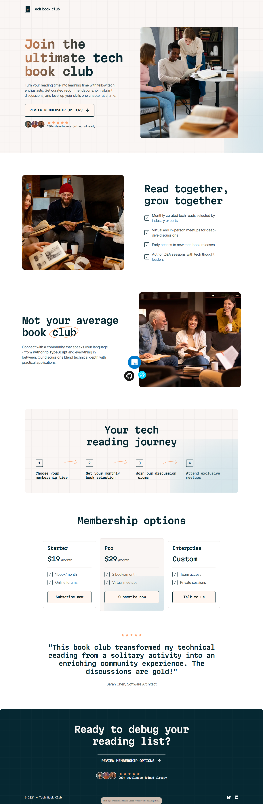

## Tech book landing page

## Welcome! 👋

### 🌐 **Links**
- 🔗 [GitHub](https://github.com/sukanyagurav/Tech-book-club-landing-page)
- 🚀 [Live URL](https://techbook-landing-page.netlify.app/)

    <h2>⚡ Tech stack used</h2>

 

## 📜 Features
Users should be able to:

- View the optimal layout for the interface depending on their device's screen size
- See hover and focus states for all interactive elements on the page

### 📔Tech book landing page desktop page

## Author
👩‍💻 Frontend Mentor - [@sukanyagurav](https://www.frontendmentor.io/profile/sukanyagurav) 